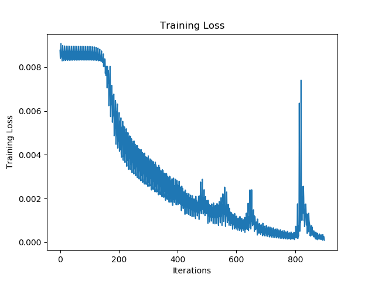
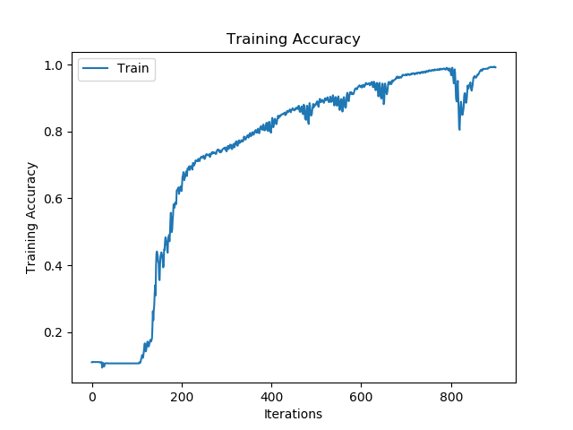

# Gesture Recognition
In this repository a convolutional neural network is designed to classify images of sign language gestures. There are 9 categories corresponding to the letters ranging from A-I. The gesture images corresponding to these letters were gathered manually through a group submission system. The following are some examples of various sign language gestures:


*Figure 1: An image corresponding to the letter A*


*Figure 2: An image corresponding to the letter D*


*Figure 3: An image corresponding to the letter H*

## Data Pre-Processing
### Data Collection
Each student submitted three images of their own hand gestures for each gesture from A to I. Students were to take these images on a white background so that the images of their hand would be clear. Each student was to ensure that only their hand was in the frame. No sleeves or watches were to be included. Further, students were encouraged to rotate the gesture so that the model could become robust to rotation. One problem that we should look out for is the lack of ethnically diverse images. Our model may perform better on lighter hands than darker hands. We want to ensure that our model does not contain this type of bias and if it does, we need to be aware of it. 

102 students submitted photos. These images were organized into folders. The "A" folder contains all of the images pertaining to the "A" sign, "B" to the "B" sign, and so on. Each image file was named using the following convention: 

```<student index>_<sign letter>_<image number>.jpg```

For example, the 15th student's second image of the sign "H" was named ```15_H_2.jpg```. This naming convention made it easy to sort the images. Prior to defining our various data partitions, the images in the dataset were examined to see if there were any problems with the collected data. 

Despite the abundantly clear instructions, many students mis-labelled their images. Further, some students took their images from far away wearing long-sleeved shirts:


*Figure _: Example of an unexpected image input (```77_D_1.jpg```)*

The wrongly labelled images were re-labeled and moved to the directories that they belonged. Images that included sleeves were either removed or cropped such that only the hand was visible. 

### Data Loading and Splitting
After these issues were resolved, the data was loaded and split into training, validation, and testing sets. To ensure that the model was not biased, students present in the training set were not present in the validation or testing sets. Given that each student's index is random, by selecting the first 70% of students to be in the training set, the next 15% to be in the validation set, and the last 15% to be in the testing set, a random split was obtained. Using more training data as opposed to validation and testing data ensures that the model can learn the complex relationships between the input images and the output categories. More validation and testing data results in better generalization. A 70-15-15 training-validation-testing split was used as opposed to a 60-20-20 or an 80-10-10 because I wanted my model to be able to generalize fairly well without sacrificing losing too much of its ability to capture these relationships. ```full_data/load_gesture_data.py``` loads the data and splits the data into training, validation, and testing Data objects defined in ```general/helpers.py```:

```python
class Data:
    def __init__(self, images, labels):
        self.labels = labels
        self.images = images

    def __len__(self):
        return len(self.labels)

    def __getitem__(self, index):
        x = self.images[index]
        y = self.labels[index]
        return x, y
```

Since the data organization process takes some time, these Data objects were then stored in data object files using pickle.dump for quick data loading during training and testing. The sizes of each data object are delineated below:

```python
Length of dataset: 2308
Length of training dataset: 1620
Length of validation dataset: 346
Length of testing dataset: 342
Training-Valdation-Testing Split = 70.19-14.99-14.82
```


Originally, a subset of the dataset was used to ensure that the program could successfully achieve perfect training 
accuracy. The loss and accuracy plots corresponding to this dataset are illustrated below:


*Figure 4: The training accuracy of the CNN when applied to a subset of the data*


*Figure 5: The training loss of the CNN when applied to the same dataset subset*

After the program was verified, the design of the network began.

## Architecture
The selected architecture for the convolutional neural network is illustrated by the code snippet below:
```python
class CNN(nn.Module):
    def __init__(self):
        super(CNN, self).__init__()
        self.conv1 = nn.Conv2d(3, 6, kernel_size=3, stride=1, padding=1)
        self.conv2 = nn.Conv2d(6, 18, kernel_size=5, stride=2)
        self.conv3 = nn.Conv2d(18, 24, kernel_size=7)
        self.pool = nn.MaxPool2d(kernel_size=2, stride=2)
        hidden_layer_size = 128
        hidden_layer_2_size = 64
        self.fc1 = nn.Linear(24 * 10 * 10, hidden_layer_size)
        self.fc2 = nn.Linear(hidden_layer_size, hidden_layer_2_size)
        self.fc3 = nn.Linear(hidden_layer_2_size, 9)

    def forward(self, x):

        x = self.pool(F.relu(self.conv1(x)))
        x = self.pool(F.relu(self.conv2(x)))
        x = self.pool(F.relu(self.conv3(x)))
        x = x.view(-1, 24 * 10 * 10)

        x = F.relu(self.fc1(x))
        x = F.relu(self.fc2(x))
        x = self.fc3(x)

        return (x)
```
Three conv-pool layers were used followed by three fully-connected layers. The conv-pool layers
progressively increased in depth and decreased in width. The fully connected layers followed a similar pattern
with hidden layer sizes of 128 and 64, respectively.

## Network Features
The network was prone to instability. As such, a relatively small learning rate of 0.0005 was selected along with a
batch size of 256. The network used an Adam optimizer and cross-entropy loss. The use of momentum and a scheduler 
did not yield stronger results. The network features mentioned above produced a strong testing accuracy and a stable 
training curve.

## Results
The loss and accuracy training curves obtained using the parameters mentioned above are displayed below:



*Figure 6: Training loss curve for the full gesture dataset using the hyper-parameters delineated above*



*Figure 7: Training accuracy curve for full gesture dataset using the hyper-parameters delineated above*

After training the network, I loaded the weight setting that produced the smallest validation loss. These weights are 
saved in the "full_data/models" folder. Using this set of weights, this network achieved a testing accuracy of 81.29% 
on the holdout dataset.  

## Discussion
One reason that this network could not achieve a higher test accuracy is that the network is not robust to rotation. 
Many sign language images were captured from unique angles that the network likely failed to identify. Consider the 
image below:


*Figure 8: Unique angle of the sign language gesture corresponding to the letter D*

The image above is labeled as the letter D. The network failed to classify this image as a D and instead classified it
as an I. The sign language gesture for the letter I is illustrated below:


*Figure 9: The sign language gesture corresponding to the letter I*

From Figures 8 and 9 we can see that the network failed to remain robust to rotation. 

Another possible reason for inaccuracy in this network stems from the lack of balance in the dataset. The network 
performed significantly weaker on ethnic hands as opposed to white hands because of the disproportionate amount of white
hands in the dataset. To rectify this problem one could use a sub-sampler to ensure that a balance was achieved while 
training. We could also improve the test accuracy by increasing the size of the training data. Only 1000 training data
were used. 

Nonetheless, this network produced reasonable testing accuracy. Through the implementation of this project I gained
experience in PyTorch and strengthened my understanding of neural networks. 


