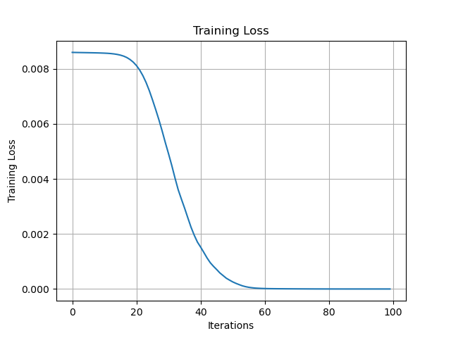
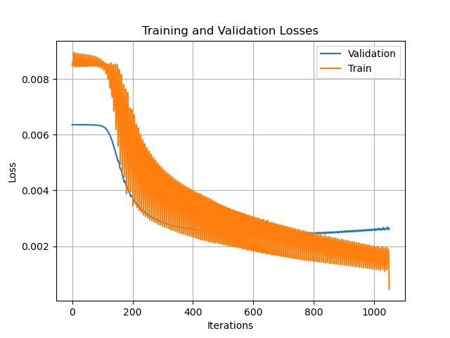

# Gesture Recognition
In this repository a convolutional neural network is designed to classify images of sign language gestures. There are 9 categories corresponding to the letters ranging from A-I. The gesture images corresponding to these letters were gathered manually through a group submission system. The following are some examples of various sign language gestures:


*Figure 1: An image corresponding to the letter A*


*Figure 2: An image corresponding to the letter D*


*Figure 3: An image corresponding to the letter H*

## Data Pre-Processing
### Data Collection
Each student submitted three images of their own hand gestures for each gesture from A to I. Students were to take these images on a white background so that the images of their hand would be clear. Each student was to ensure that only their hand was in the frame. No sleeves or watches were to be included. Further, students were encouraged to rotate the gesture so that the model could become robust to rotation. One problem that we should look out for is the lack of ethnically diverse images. Our model may perform better on lighter hands than darker hands. We want to ensure that our model does not contain this type of bias and if it does, we need to be aware of it. 

102 students submitted photos. These images were organized into folders. The "A" folder contains all of the images pertaining to the "A" sign, "B" to the "B" sign, and so on. Each image file was named using the following convention: 

```<student index>_<sign letter>_<image number>.jpg```

For example, the 15th student's second image of the sign "H" was named ```15_H_2.jpg```. This naming convention made it easy to sort the images. Prior to defining our various data partitions, the images in the dataset were examined to see if there were any problems with the collected data. 

Despite the abundantly clear instructions, many students mis-labelled their images. Further, some students took their images from far away wearing long-sleeved shirts:


*Figure 4: Example of an unexpected image input (```77_D_1.jpg```)*

The wrongly labelled images were re-labeled and moved to the directories that they belonged. Images that included sleeves were either removed or cropped such that only the hand was visible. 

### Data Loading and Splitting
After these issues were resolved, the data was loaded and split into training, validation, and testing sets. To ensure that the model was not biased, students present in the training set were not present in the validation or testing sets. Given that each student's index is random, by selecting the first 70% of students to be in the training set, the next 15% to be in the validation set, and the last 15% to be in the testing set, a random split was obtained. Using more training data as opposed to validation and testing data ensures that the model can learn the complex relationships between the input images and the output categories. More validation and testing data results in better generalization. A 70-15-15 training-validation-testing split was used as opposed to a 60-20-20 or an 80-10-10 because I wanted my model to be able to generalize fairly well without sacrificing losing too much of its ability to capture these relationships. ```full_data/load_gesture_data.py``` loads the data and splits the data into training, validation, and testing Data objects defined in ```general/helpers.py```:

```python
class Data:
    def __init__(self, images, labels):
        self.labels = labels
        self.images = images

    def __len__(self):
        return len(self.labels)

    def __getitem__(self, index):
        x = self.images[index]
        y = self.labels[index]
        return x, y
```

Since the data organization process takes some time, these Data objects were then stored in data object files using pickle.dump for quick data loading during training and testing. The sizes of each data object are delineated below:

```python
Length of dataset: 2308
Length of training dataset: 1620
Length of validation dataset: 346
Length of testing dataset: 342
Training-Valdation-Testing Split = 70.19-14.99-14.82
```

After saving these data files, ```train_model``` and ```test_model``` functions were defined in ```train.py``` and ```test.py```, respectively. Then, the model design process began. To ensure that the ```train_model``` and ```test_model``` functions were defined properly, then they would be able to achieve 100% training accuracy on a smaller dataset. Thus, a dataset containing just the images that I took was created. Simple models were constructed and run on this small dataset. The loss and accuracy plots corresponding to this dataset are illustrated below:


*Figure 5: The training accuracy of a simple CNN when applied to a subset of the data*



*Figure 6: The training loss of a simple CNN when applied to the same dataset subset*

From the plots above, we can see the training accuracy shoot up to 100% and the training loss quickly approach a negligible value. The training function will be discussed in detail in the coming sections.

## Architecture Selection
### Motivation
Fully-connected layers alone can not effectively categorize images. Convolutional neural networks, however, can. There are a few reasons for this.

1. Convolutional layers utilize weight sharing accross the kernels
2. Convolutional layers recognize the spacial locality of the image features
    - The order of the inputs does not change the way that fully-connected layers learn from their data
3. Convolutional layers followed by pooling layers are robust to image translation and rotation

Smaller kernels are able to learn local features whereas larger features interpret information more generally. Therefore, the strategy for the design of this network is to start with small filters, keeping the feature space wide and shallow, collecting information about the various edges and color changes present in the image. Then, gradually increase the filter sizes and the number of feature maps as the network grows. Finally, flatten the output of the last convolutional layer and feed this output into a fully-connected neural network.

### Architecture
The selected architecture for the convolutional neural network is illustrated by the code snippet below:
```python
class CNN(nn.Module):
    def __init__(self):
        super(CNN, self).__init__()
        self.conv1 = nn.Conv2d(3, 6, kernel_size=3, stride=1, padding=1)
        self.conv2 = nn.Conv2d(6, 18, kernel_size=5, stride=2)
        self.conv3 = nn.Conv2d(18, 24, kernel_size=7)
        self.pool = nn.MaxPool2d(kernel_size=2, stride=2)
        hidden_layer_size = 128
        hidden_layer_2_size = 64
        self.fc1 = nn.Linear(24 * 10 * 10, hidden_layer_size)
        self.fc2 = nn.Linear(hidden_layer_size, hidden_layer_2_size)
        self.fc3 = nn.Linear(hidden_layer_2_size, 9)

    def forward(self, x):

        x = self.pool(F.relu(self.conv1(x)))
        x = self.pool(F.relu(self.conv2(x)))
        x = self.pool(F.relu(self.conv3(x)))
        x = x.view(-1, 24 * 10 * 10)

        x = F.relu(self.fc1(x))
        x = F.relu(self.fc2(x))
        x = self.fc3(x)

        return (x)
```
Three conv-pool layers were used followed by three fully-connected layers. The conv-pool layers
progressively increased in depth and decreased in width. The fully connected layers followed a similar pattern with hidden layer sizes of 128 and 64, respectively. Each convolutional layer was followed by a ReLU activation function to introduce non-linearity. ReLU activation functions were also used as activation functions for the fully-connected layers because the ReLU activation function is efficient compared to the sigmoid or tanh activation functions. Given the complexity of our model, efficiency was particularly important. This network was the last in a long line of failed candidate models. Originally, a much more simple structure was hypothesized but it failed to capture the complex relationships present in the data. 

## Training Parameters
The chosen network is complex and the inputs to the network are large. Training this network took hours to complete. The complexity of the network was considered when selecting an optimizer and loss function. Ultimately, the Adam optimizer was selected because of its efficiency and rapid convergence when compared with basic gradient descent. Stochastic gradient descent was also tried, but it failed to converge to a reasonable minima after a tremendous amount of iterations. The multi-class cross entropy loss function was selected. This loss function is the standard loss function for multi-class classification and straying from it is only wise when your data is particularly sparse or your data has some unique property that you can exploit. 

## Results
The loss and accuracy training curves obtained using the previously defined model are displayed below:



*Figure 7: Training and validation loss curve for the full gesture dataset*


*Figure 8: Training and validation accuracy curve for full gesture dataset*

From the above images we can see that oscillation exists in our loss and accuracy plots. This typically occurs when the learning rate is too large or the batch size is too small. While oscillation does exist, the training loss approaches 0, the final training accuracy reaches 99.5%, and the validation loss clearly reaches some sort of minima. 

To select a model from this plot we choose the model that minimizes the validation loss. After this point the model begins to overfit to the training dataset as the training loss continues to decrease while the validation loss increases. The optimal model, as delineated by this graph and from observing the validation loss of all of the models, occurs at iteration 460. 


Using the set of weights obtained at iteration 460, this network achieved a testing accuracy of 83.62% 
on the holdout dataset.  

## Potential Improvements
This testing accuracy is reasonble considering the implicit limitations. Only 74 students were used to train the data. We don't expect our model to be able to perfectly predict on unseen data given this tremendous lack of training and validation data. 

This model could be significantly improved if more data was collected. This data could be manually generated by taking photos of different signs in a variety of different settings and from different angles. This data could also be generated through surveying or through another class assignment akin to the one spawning this report. 

Another limitation of the model is it may or may not perform well on those with darker skin. Almost all of the images in the training, validation, and testing set were of students with light skin. This model is likely biased. To rectify the bias, more data samples of persons with dark skin must be collected. 

This project could also be extended by merging real-time event detection (https://www.youtube.com/watch?v=QcCjmWwEUgg) with an extended form of this model.

Stay tuned for the next chapter of this project. 


